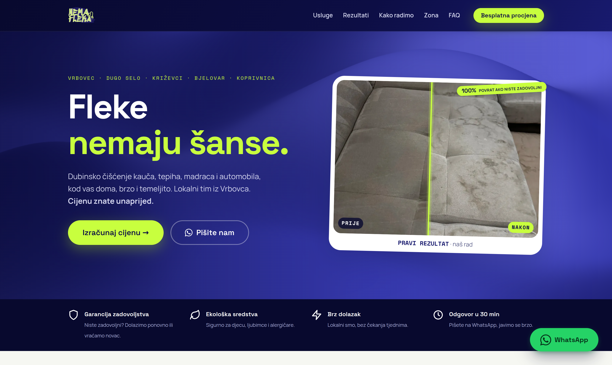

# Nema Fleka — web stranica za dubinsko čišćenje

Landing stranica za lokalni servis dubinskog čišćenja (kauči, tepisi, madraci, automobili) na
području Vrbovca i okolice (Dugo Selo → Koprivnica). Lokalni tim, transparentne cijene, garancija.

🔗 **Live:** [nemafleka.com](https://nemafleka.com)



---

## Što stranica radi

- 💶 **Transparentni cjenik** — konkretne stavke, bez „od X €“. Paket, minimalni izlazak i
  putne zone na jednom mjestu. WhatsApp s cjenika šalje predpopunjenu poruku.
- 📍 **Putni model** — besplatan dolazak u lokalnoj zoni oko Vrbovca; Bjelovar i Koprivnica
  +15 €; Zagreb istok +20 € uz viši minimum.
- 🖼️ **Before/after slider** — prave fotke, `clip-path` reveal (slike se otkrivaju, ne razvlače).
- 🎨 **WebGL „shader" hero** (vanilla, bez frameworka) + navy/lime design system.
- 📱 **Responzivno** — fluidna tipografija i provjereni layout na 4 referentna uređaja
  (Pixel · iPhone 13 Pro · iPad · desktop); 0 horizontalnog overflowa.
- 🔎 **Lokalni SEO** — `LocalBusiness` + `FAQPage` JSON-LD, kanonska apex domena s
  www→non-www 301 redirectom, sitemap, self-hostani fontovi, `.webp` slike.

## Tehnologije

- **Astro** — statički build (`output: 'static'`, zero JS osim interaktivnih otoka), deploy na **Vercel**
- **TypeScript** — tipizirani podatkovni sloj (cijene, zone, WhatsApp linkovi)
- **Vanilla islands** (bez frameworka) — before/after slider, Leaflet karta, mobilni meni, [whatamesh](https://github.com/Razzwan/whatamesh) shader gradient
- **Vitest** (unit) + **Playwright / axe-core** (E2E + a11y)
- Samostalno hostani fontovi (Space Grotesk / Manrope / Space Mono)

## Pokretanje

```bash
npm install
npm run dev        # lokalni dev server
npm run build      # statički build u dist/
npm run preview    # pregled builda
npm test           # vitest (cijene + WhatsApp linkovi)
npm run test:e2e   # playwright (treba pokrenut server na :8088 ili BASE_URL)
```

Provjera responzivnosti: skill u `.claude/skills/responsive-check/` snima obje stranice na 4
viewporta i javlja overflow + veličine fontova.

## Struktura

```
src/
  data/        # JEDAN izvor istine: services, pricing, towns, business, faq
  lib/         # jsonld.ts, format.ts, links.ts
  layouts/     # BaseLayout.astro (head, fontovi, canonical/OG, JSON-LD)
  components/
    primitives/  # Button, Eyebrow, SectionHeader, Icon
    sections/    # Hero, TrustStrip, Services, PriceCard, Timeline, About, FaqList, ContactCTA, Nav, Footer
    islands/     # BeforeAfter, Coverage (Leaflet), MobileNav, ShaderBg
  pages/       # index.astro, podrucje-pokrivenosti.astro
  styles/      # tokens.css (design tokeni), global.css, components.css
public/images/ # WebP + favicons
```

### Jedan izvor istine za cijene/mjesta
Cijene, veličine i popusti žive **samo** u `src/data/services.ts` + `pricing.ts`; mjesta u
`towns.ts`. Cjenik, karta i JSON-LD čitaju isto → cijene se ne mogu razići (kao prije:
home 45€ vs grad 40€). Promijeniš cijenu na jednom mjestu i mijenja se svugdje.

## Politika poštenog sadržaja
Bez izmišljenih recenzija, ocjena ili brojača klijenata (Google + EU/HR pravni rizik).
Povjerenje grade: pravi before/after, garancija zadovoljstva, lokalna priča, odgovor u 30 min.
Obrt još nije registriran → impressum nosi pošten disclaimer, **bez izmišljenog OIB-a**.

## Deploy
Vercel (auto-detekcija Astro). `vercel.json`: www→non-www 301, 301 redirecti starih
`/dubinsko-ciscenje-*` URL-ova na `/podrucje-pokrivenosti`, immutable cache za `/_astro` i
`/images`, security headeri.

## Preostalo (čeka vlasnika — označeno `[POTVRDITI]` u kodu)
- [ ] Po registraciji obrta: OIB, puni naziv i adresa sjedišta (`src/data/business.ts` →
  `registered: true`; Footer automatski prebaci na puni impressum)
- [ ] Founder foto + priča za „Tko smo"
